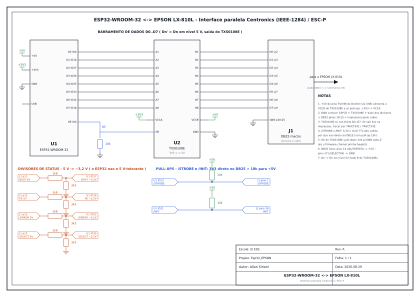

# Ligações — ESP32 → EPSON LX-810L (paralela Centronics)

> ⚠️ **Antes de tudo:** a impressora se alimenta pela tomada, não pelo ESP32.
> Nunca ligue/desligue os fios com os equipamentos energizados. O ESP32 **não é
> tolerante a 5 V** — é por isso que os retornos da impressora passam por divisor
> resistivo.

## Esquema elétrico (prancha A3)



- Arquivos: [`schematic.svg`](schematic.svg) (vetorial, abre no navegador) e
  [`schematic.png`](schematic.png).
- Gerado por [`tools/schematic.py`](../tools/schematic.py) (SVG feito à mão, sem
  dependências). Edite o mapa de pinos lá — ele espelha `include/config.h` — e
  rode `python3 tools/schematic.py` para regenerar. O PNG sai se houver
  `rsvg-convert` **ou** o pacote python `cairosvg` (senão, fica só o SVG).
- Referência rápida em texto (netlist): `python3 tools/wiring_diagram.py --print`.

## Visão geral

```
                 +3V3 ─┐                          +5V (pino "5V"/"VIN" do ESP32, vem do USB)
                       │                           │
  ESP32            ┌───┴────────────┐          ┌───┴──────┐
  ┌───────┐        │   TXS0108E     │          │ pull-ups │
  │ GPIO  │ D0..D7 │ A1..A8  B1..B8 │ D0..D7   │  10k x2  │
  │ 13..21├────────┤(lado 3V3)(5V)  ├──────────┤ /STROBE  ├───► DB25 ──cabo──► LX-810L
  │       │        │  OE ◄── GPIO4  │          │ /INIT    │      (macho)      (Centronics 36)
  │ 19,18 ├────────────────────────────────────┤          │
  │       │        └────────────────┘          └──────────┘
  │ 34,35 │◄──── divisor 1k8/3k3 ◄──────────────────────────── BUSY, PE
  │ 39,36 │◄──── divisor 1k8/3k3 ◄──────────────────────────── /ERROR, SELECT
  └───┬───┘
      │
     GND ─────────── comum: ESP32 GND + TXS0108E GND + base dos divisores + DB25 18..25
```

Fonte dos 5 V: pino **`5V`** (ou `VIN`) do DevKit — ele espelha os 5 V do USB.
Como o ESP32 está sempre plugado no PC, isso é suficiente. O **GND tem que ser
comum** entre ESP32 e impressora (os fios de GND do cabo já fecham isso).

---

## Conector DB25 (lado do PC) — é aqui que encaixa o seu cabo

O seu cabo é DB25-macho ↔ Centronics-36. Solde um **DB25 macho** no seu
protoboard/perfboard e ligue conforme a tabela. O cabo entra nesse DB25 e a outra
ponta vai na impressora.

| DB25 | Sinal      | Sentido        | Liga em                              | Como |
|-----:|------------|----------------|-------------------------------------|------|
| 1    | /STROBE    | ESP32 → impr.  | GPIO **19**                         | direto + pull-up 10k p/ +5V |
| 2    | D0         | ESP32 → impr.  | TXS0108E **B1** (A1 ← GPIO13)        | pelo level shifter |
| 3    | D1         | ESP32 → impr.  | TXS0108E **B2** (A2 ← GPIO14)        | pelo level shifter |
| 4    | D2         | ESP32 → impr.  | TXS0108E **B3** (A3 ← GPIO27)        | pelo level shifter |
| 5    | D3         | ESP32 → impr.  | TXS0108E **B4** (A4 ← GPIO26)        | pelo level shifter |
| 6    | D4         | ESP32 → impr.  | TXS0108E **B5** (A5 ← GPIO25)        | pelo level shifter |
| 7    | D5         | ESP32 → impr.  | TXS0108E **B6** (A6 ← GPIO23)        | pelo level shifter |
| 8    | D6         | ESP32 → impr.  | TXS0108E **B7** (A7 ← GPIO22)        | pelo level shifter |
| 9    | D7         | ESP32 → impr.  | TXS0108E **B8** (A8 ← GPIO21)        | pelo level shifter |
| 10   | /ACK       | impr. → ESP32  | *(não usado)* — opcional            | divisor 1k8/3k3 p/ um GPIO livre |
| 11   | BUSY       | impr. → ESP32  | GPIO **34**                         | **divisor 1k8/3k3** |
| 12   | PE         | impr. → ESP32  | GPIO **35**                         | **divisor 1k8/3k3** |
| 13   | SELECT     | impr. → ESP32  | GPIO **36** (SVP)                   | **divisor 1k8/3k3** |
| 14   | /AUTOFEED  | ESP32 → impr.  | **+5V**                             | jumper fixo (desliga auto-LF) |
| 15   | /ERROR     | impr. → ESP32  | GPIO **39** (SVN)                   | **divisor 1k8/3k3** |
| 16   | /INIT      | ESP32 → impr.  | GPIO **18**                         | direto + pull-up 10k p/ +5V |
| 17   | /SELECT-IN | ESP32 → impr.  | **GND**                             | jumper fixo (mantém selecionada) |
| 18–25| GND        | —              | **GND comum**                       | todos juntos |

> Centronics-36 (lado da impressora), se você preferir soldar direto nela:
> 1=/STROBE · 2–9=D0–D7 · 10=/ACK · 11=BUSY · 12=PE · 13=SELECT · 14=/AUTOFEED
> · 16=GND lógico · 31=/INIT · 32=/ERROR · 19–30=GND · 36=/SELECT-IN.

---

## TXS0108E (o módulo de 8 canais que você já tem)

| Pino TXS0108E | Liga em |
|---------------|---------|
| VCCA          | **3V3** do ESP32 |
| VCCB          | **+5V** (pino `5V`/`VIN` do ESP32) |
| GND           | GND comum |
| OE            | GPIO **4** + **pull-down 10k p/ GND** |
| A1..A8        | GPIO 13, 14, 27, 26, 25, 23, 22, 21 |
| B1..B8        | DB25 pinos 2, 3, 4, 5, 6, 7, 8, 9 |

- **VCCA sempre ≤ VCCB.** Aqui: 3,3 V no A, 5 V no B. Correto.
- O `OE` com pull-down garante que o conversor fique em **alta impedância** até o
  firmware chamar `printer.begin()` — sem isso, os pinos poderiam "chiar" dados
  na impressora durante o boot.
- O TXS0108E tem *auto-direção*. Para D0..D7 (sempre ESP32 → impressora) ele
  funciona, mas é o elo mais frágil. **Se a impressão sair com caracteres
  trocados/lixo**, troque os 8 bits de dados por um **74HCT541** ou **74HCT245**
  (entrada compatível com 3,3 V, saída push-pull real de 5 V) — é à prova de
  falhas para barramento unidirecional.

---

## Divisor resistivo (todos os sinais que vêm da impressora)

Sinais BUSY, PE, /ERROR e SELECT saem da impressora em **5 V**. Cada um:

```
  DB25 (BUSY / PE / ERROR / SELECT)
        │
      [ 1k8 ]        (R de cima)
        │
        ├───────────►  GPIO do ESP32  (34 / 35 / 39 / 36)
        │
      [ 3k3 ]        (R de baixo)
        │
       GND  (comum)
```

`Vgpio = 5 V × 3k3 / (1k8 + 3k3) ≈ 3,24 V` → nível alto seguro, sem passar de 3,3 V.

- Valores alternativos aceitáveis: 10k/15k (carrega menos a saída da impressora).
- São 4 divisores → **4× 1k8 + 4× 3k3**.
- Com a **impressora desligada**, esses pinos são puxados a GND pelo resistor de
  baixo → o firmware lê `SELECT = baixo` (offline) e `/ERROR = baixo` (falha) e
  **não tenta imprimir**. É o comportamento desejado.

---

## /STROBE e /INIT (saídas do ESP32 direto no DB25)

```
  GPIO19 ──┬────────────►  DB25 pino 1  (/STROBE)
           │
         [ 10k ]
           │
          +5V
```
(idêntico para **GPIO18 → DB25 pino 16 (/INIT)**, com outro 10k para +5V)

- 3,3 V já é "nível alto" válido para a entrada TTL da impressora, então não
  precisa passar pelo conversor.
- O **pull-up de 10k para +5V** mantém a linha **inativa (alta)** enquanto o
  ESP32 reinicia, evitando um pulso de strobe/reset acidental.
- Opcional (proteção extra contra curto): um resistor de **1k em série** entre o
  GPIO e o DB25.

---

## Lista de componentes (BOM)

| Item | Qtd | Observação |
|------|----:|------------|
| ESP32 DevKit (WROOM-32 ou WROVER) | 1 | já conectado no USB |
| TXS0108E (módulo 8 canais) | 1 | você já tem |
| Resistor 1,8 kΩ | 4 | topo dos divisores |
| Resistor 3,3 kΩ | 4 | base dos divisores |
| Resistor 10 kΩ | 3 | pull-up /STROBE, pull-up /INIT, pull-down OE |
| Resistor 1 kΩ | 2 | *opcional*, em série com /STROBE e /INIT |
| Conector DB25 macho (solda) | 1 | onde encaixa o cabo |
| Cabo paralelo DB25 ↔ Centronics-36 | 1 | você já tem |
| Protoboard + jumpers | — | |

---

## Por que este mapa de pinos

Evitamos os pinos que causam dor de cabeça no ESP32 clássico:

| Pinos | Motivo | No projeto |
|-------|--------|------------|
| 6–11 | ligados à flash SPI | nunca usados |
| 0, 2, 5, 12, 15 | *strapping* (estado no boot importa) | só GPIO2 (LED), configurado após o boot |
| 16, 17 | PSRAM nos módulos WROVER | não usados |
| 34–39 | **somente entrada**, sem pull interno | usados de propósito para os status (nível vem do divisor) |
| 1, 3 | UART0 = USB (a "ponte") | reservados para a Serial |

Ordem de energização sugerida: conecte o GND primeiro, depois ligue o ESP32
(USB) e por último a impressora. Confira toda a fiação com a impressora
**desligada** antes do primeiro teste.
